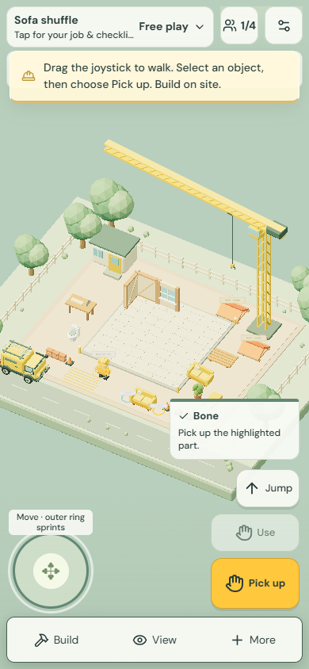
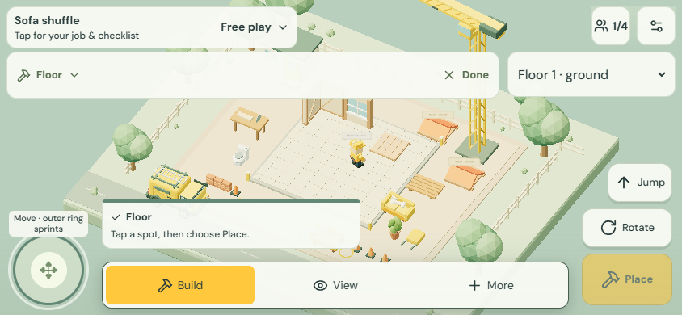
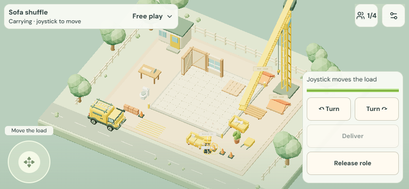

# Permit Pending: Touch-Umsetzung und Prüfung

Stand: 8. September 2026. Umsetzung des freigegebenen [Touch-Entwurfs](../specs/2026-09-08-permit-pending-mobile-touch-design.md) für `/chaos`.

## Änderungen

- Feste Aktionsplätze für Springen, Nebenaktion und Hauptaktion. Objektname, Reichweite, Fehler und Anfahrt sind direkt sichtbar.
- Ein Welt-Tap wählt ein Objekt. „Pick up“ beziehungsweise „Fetch“ hebt es auf; „Use“ bleibt eine getrennte Aktion.
- „Put down“ sichert den Gegenstand an der sichtbaren Ablagestelle. Vorschau und Server verwenden dieselbe Platzierungsberechnung. „Throw“ ist eine eigene Aktion; die gewählte Richtung bleibt bei Bewegung und Kameradrehung erhalten.
- Bauen braucht „Place“. Welt-Taps positionieren die Vorschau; ein sichtbarer 56-Pixel-Griff verschiebt sie. Loslassen und Kameragesten bestätigen nichts. Streichen und Entfernen werden ebenfalls bewusst bestätigt; die Farbvorschau verändert nur die lokale Darstellung.
- Linker Joystick mit Sprint im Außenbereich; getrennte Finger können bewegen, springen, werfen oder Halteaktionen bedienen. Kontaktabbruch, Fokusverlust, Hintergrund und Fensterwechsel setzen Eingaben zurück. Ein Ziel- oder Werkzeugwechsel kann einen begonnenen Tastendruck nicht auf eine neue Aktion umdeuten.
- Dachkran mit Auswahl, „Lift roof“, Phasenanzeige, Drehen, „Place roof“ und „Return roof“. Crew-Rollen verwenden eigene Steuerungen; Bewegung der Last folgt auf Touch der Kamera. Leiterhalten, Klettern und Einweisen berücksichtigen die jeweilige Rolle.
- Teamaktionen, Sprache/Funk, Hilfe, Kamera, Projekte, gespeicherte Bauten und Medien sind mobil erreichbar. Sprach-Haltetasten verwenden dieselbe Kontaktverwaltung. Menüs stoppen lokale Eingaben, während das gemeinsame Spiel weiterläuft.
- Safe Areas, kompakte Hoch-/Querformat-Anordnung, 48-Pixel-Bedienflächen und 64-Pixel-Hauptaktion. Dialoge berücksichtigen die visuelle Viewport-Höhe. Maus-/Tastatur-Eingabe bleibt von der kompakten Anordnung getrennt.

Kontexthinweise bleiben während des Spiels verfügbar; eine wieder aufrufbare Kurzanleitung steht unter „More → Touch controls“. Die bestehende englische Spielsprache wurde beibehalten.

## Automatisierte Prüfungen

- `npm run test:handwerker`: **215 bestanden, 0 fehlgeschlagen**. Enthält Szenen-, Gesten-, Joystick-, Netzwerk-, Physik-, Modell-, Kran-, Crew-, Speicher- und Audioprüfungen.
- Neue Prüfungen sichern unter anderem feste Befehlsidentität, Mehrfinger-Freigabe, Sprint-Hysterese, kameraabhängige Bewegung, unveränderte Wurfrichtung bei Warteschlangen und Übereinstimmung von Ablagevorschau und Spielregel.
- Abschließender projektweiter `npm run typecheck` und `npm run lint`: erfolgreich. Auch der gezielte Lint-Durchlauf für `games/chaos` ist erfolgreich.
- Die Formatprüfung der 19 betroffenen Code-/Test-/CSS-Dateien ist erfolgreich.
- `npm run check:architecture`: 400 Dateien und 1130 lokale Importe geprüft.
- `npm run build` und `npm run build:railway`: Produktions-Builds geprüft. Die vorhandenen Hinweise zu großen Chunks und Vites JSON-Import-Konfiguration sind weiterhin vorhanden.

## Browserprüfung

Headless Chrome mit echter Pointer-/Touch-Ereigniserzeugung, gegen einen lokalen Node-Spielserver und eine getrennte temporäre SQLite-Testdatenbank. Keine Änderung an produktiven Spielständen.

Erfolgreich durchgespielt:

1. 390 × 844: Kopfzeile ohne Überlappung, Aufheben sendet genau einen Befehl und zeigt danach getrennt Ablegen/Werfen.
2. Zwei Finger: Sprinten und Werfen gleichzeitig; Freigabe des Aktionsfingers unterbricht den Joystick nicht, Loslassen des Joysticks beendet die Bewegung.
3. Mehrere Welt-Taps und Ziehen am Baugriff senden keinen Bauauftrag; „Place“ führt nach der Anfahrt genau einen Bau aus.
4. 844 × 390: kompakte Bauleiste und scrollbares Kamera-Menü, Schließen-Fläche mindestens 48 × 48 Pixel.
5. Ego-Kamera: Ziehen sowie Loslassen eines anderen Fingers lösen keine Spielaktion aus.
6. 320 × 568: Joystick, Springen, beide Aktionen und Menüleiste bleiben innerhalb des Viewports.
7. „More“ bietet Projekte, Foto, Anleitung, gespeicherte Bauten und Sprache/Clips.
8. Dach auswählen → ausdrücklich anheben → auf „ready“ warten → zurückgeben. Jeweils genau ein Anhebe- und Rückgabebefehl.
9. Crew-Griff anlaufen → Rolle übernehmen → Last drehen → Rolle freigeben. Objektsteuerung wird passend ersetzt und wiederhergestellt.
10. Keine Browser-Laufzeitfehler im erfolgreichen Durchlauf.

Die Browserprüfung fand auch einen Grenzfall beim Erreichen eines Crew-Griffs: Der Befehl konnte eine Position aus dem vorigen Frame enthalten. Teamaktionen übernehmen nun die aktuelle lokale Position beim Auslösen.

## Grenzen der Prüfung

Keine Prüfung auf physischen iOS-/Android-Geräten, mit echten Mikrofon-/Systemfreigaben oder mit fünf neuen Spielern. Auch ein vollständiger Durchlauf jeder Crew-Aufgabe mit mehreren realen Teilnehmern steht aus. Die Browserprüfung deckt die oben genannten Abläufe ab; Modelltests prüfen zusätzliche Spielregeln. Die Geräte-, Tablet-, Tastatur- und Erstnutzer-Matrix des Entwurfs ist deshalb kein bereits vollständig erbrachter Abnahmenachweis.

## Veröffentlichung

Am 8. September 2026 auf ausdrücklichen Wunsch („bring it live“) auf dem bestehenden Railway-Dienst `stack-or-sink` in `production` veröffentlicht: [Permit Pending](https://jumbleyard.up.railway.app/chaos).

Für die Veröffentlichung wurde ein separater Stand mit 617 Quelldateien vorbereitet. Typcheck, alle 532 Tests des gesamten Projekts und `npm run build:railway` bestanden dort. Die Quelldateien wurden nach der Validierung per SHA-256 auf Änderungen geprüft; Datenbanken, Umgebungsdateien, Zugangsdaten und lokale Arbeitsverzeichnisse waren nicht im Upload.

Deployment `11ebc9e2-2d81-4c97-9d43-cd0624f87fd3` erreichte `SUCCESS`. Öffentliche Prüfungen bestätigten HTTP 200, eine erreichbare Datenbank und die neue Touch-Oberfläche im vom Spiel referenzierten Paket `Game-CwcvpSco.js`.

Der Live-Mehrspielertest bestand mit einer eigenen temporären Partie: vier Spieler, Raumlimit, Authentifizierung, HTTPS-Origin-Prüfung, gleichzeitiges Bauen, gemeinsamer Spielstand und Host-Wechsel. Die Testspieler verließen anschließend ihre Räume. Bestehende Produktionsdaten wurden nicht migriert oder ersetzt.
